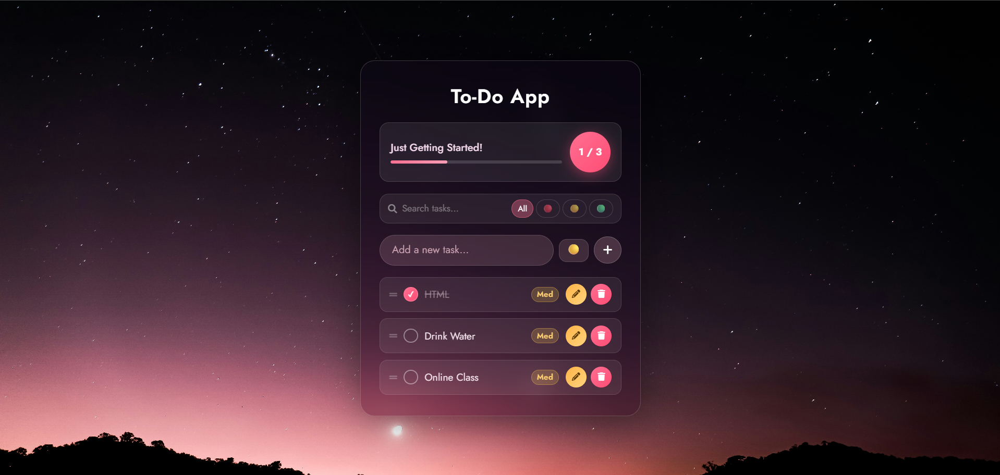

# ✅ Glassmorphism To-Do App

A beautifully designed, fully functional **To-Do List** web application built with pure **HTML, CSS, and JavaScript** — no frameworks, no dependencies. Features a stunning glassmorphism UI, smooth animations, and a rich set of productivity features.



---

## 🌟 Features

| Feature | Description |
|---|---|
| 🔮 Glassmorphism UI | Frosted glass card with backdrop blur and subtle borders |
| 📊 Progress Tracker | Animated progress bar + live counter showing completed vs total |
| 🔃 Drag & Drop | Reorder tasks by dragging them up or down the list |
| 🎉 Confetti | Celebratory confetti rises from the bottom when all tasks are completed |
| ✏️ Edit Tasks | Update task text via a sleek modal dialog |
| 🗑️ Delete Tasks | Remove tasks with a single click |
| 🔔 Toast Notifications | Non-intrusive feedback for every action |
| 💾 Persistent Storage | Tasks are saved to `localStorage` and survive page refresh |
| 📱 Responsive Design | Fully optimized for mobile, tablet, and desktop |

---

## 🚀 Getting Started

### Prerequisites
- A modern web browser (Chrome, Firefox, Edge, Safari)
- [VS Code](https://code.visualstudio.com/) with the **Live Server** extension *(recommended)*

### Run Locally

1. **Clone or download** this repository:
   ```bash
   git clone https://github.com/donamndl/to-do-list.git
   ```

2. **Open the folder** in VS Code:
   ```bash
   cd to-do-list
   code .
   ```

3. **Start Live Server:**
   - Click **"Go Live"** in the VS Code status bar, or
   - Right-click `index.html` → **Open with Live Server**

4. Visit `http://127.0.0.1:5500/index.html` in your browser.

> ⚠️ **Important:** Always open the **folder** in VS Code, not just the file. Live Server requires a folder root to serve correctly.

---

## 🎮 How to Use

### Adding a Task
1. Type your task in the input field
2. Press **Enter** or click the **+** button

### Managing Tasks
| Action | How |
|---|---|
| ✅ Complete a task | Click the circle checkbox on the left |
| ✏️ Edit a task | Click the **yellow pencil** button |
| 🗑️ Delete a task | Click the **pink trash** button |
| 🔃 Reorder tasks | Drag using the **⠿ grip handle** on the left |
| 🎉 Confetti | Complete **all tasks** to trigger confetti rising from the bottom |

---

## 🛠️ Built With

- **HTML5** — Semantic structure
- **CSS3** — Glassmorphism, Flexbox, animations, `backdrop-filter`
- **Vanilla JavaScript (ES6+)** — DOM manipulation, drag & drop API, Canvas API
- **Font Awesome 6** — Icons
- **Google Fonts** — Jost typeface
- **Web Storage API** — `localStorage` for data persistence

---

## ✨ Design Highlights

- **Glassmorphism card** using `backdrop-filter: blur()` with semi-transparent background
- **Smooth animations** — fade-in on load, slide-in for new tasks, pop-in for modal
- **Custom confetti engine** built on HTML5 Canvas — particles rise from the bottom upward, no external library needed
- **Input shake animation** when submitting an empty task
- **Drag-over visual feedback** with highlighted drop targets
- **Custom scrollbar** styled to match the pink color theme

---

## 🗺️ Roadmap

- [ ] Due dates & deadline reminders
- [ ] Task categories / folders
- [ ] Priority tags (High / Medium / Low)
- [ ] Search & filter bar
- [ ] Dark / Light theme toggle
- [ ] Export tasks as PDF or CSV
- [ ] PWA support (offline mode)

---

<p align="center">Made with ❤️ and vanilla JavaScript</p>